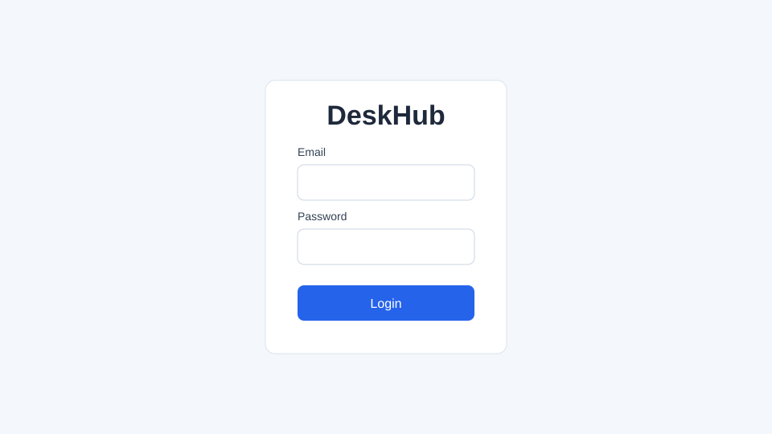
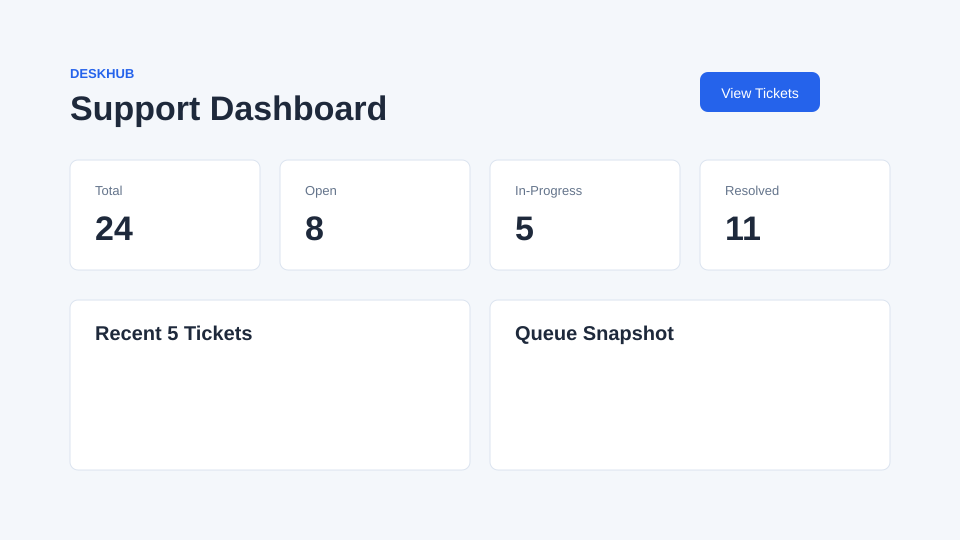
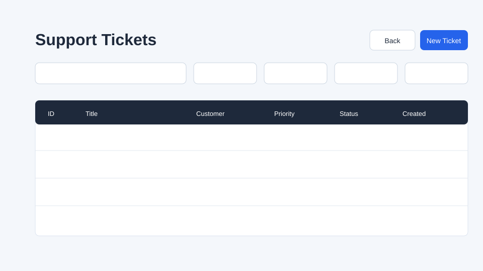

# DeskHub

DeskHub is a small support-ticket dashboard built with plain HTML, CSS, and JavaScript modules. It uses `json-server` as a local REST API and `live-server` for the browser UI.

## Setup

1. Install dependencies:

```bash
npm install
```

2. Start the API and UI:

```bash
npm run dev
```

3. Open the app:

- UI: `http://localhost:8080`
- API: `http://localhost:3001`
- Tickets API check: `http://localhost:3001/tickets`

Demo login:

- Email: `priya@deskhub.in`
- Password: `demo123`

## Screenshots







## Features

- **Light / dark theme:** Use the **gear** control on the **top bar** (fixed on every page) to open **Settings** → **Appearance** → **Light mode** or **Dark mode**. Preference is stored in `localStorage` (`deskhub_theme`). An inline script in each HTML page applies the theme before CSS loads to reduce flash.
- **Account in Settings:** When signed in, **Settings** shows your name, email, and role, plus **Log out**. On the login page, account details are hidden until you sign in.
- **CSV export:** On the tickets list, **Download CSV** saves all tickets that match the current filters and sort (not only the visible page). The file is UTF-8 with a BOM for Excel.

## Architecture Decisions

- Plain ES modules keep the project lightweight and easy to inspect.
- `src/api` owns all `fetch` calls so modules do not duplicate endpoint logic.
- `src/modules` owns page behavior, routed by `body[data-page]` in `src/main.js`.
- `src/utils` contains small shared helpers such as storage, debounce, and date formatting.
- Dashboard stat cards use `X-Total-Count` from `json-server` instead of downloading full datasets for every count.
- Ticket list filters are reflected in the URL, so filtered views can be shared or refreshed.

## Known Limitations

- Authentication is demo-only and stores a fake token in `localStorage`.
- `json-server` is not a production backend.
- There is no file upload or rich text support for comments.
- Dashboard screenshots in this repo are lightweight static reference images.
- Current test coverage is manual smoke testing through the local dev server.

## What I'd Add Next

- Real authentication and role-based permissions.
- A dedicated test suite for API helpers and page modules.
- Comment editing and deletion.
- CSV export for filtered ticket lists.
- Better seed data for local demos and screenshots.
